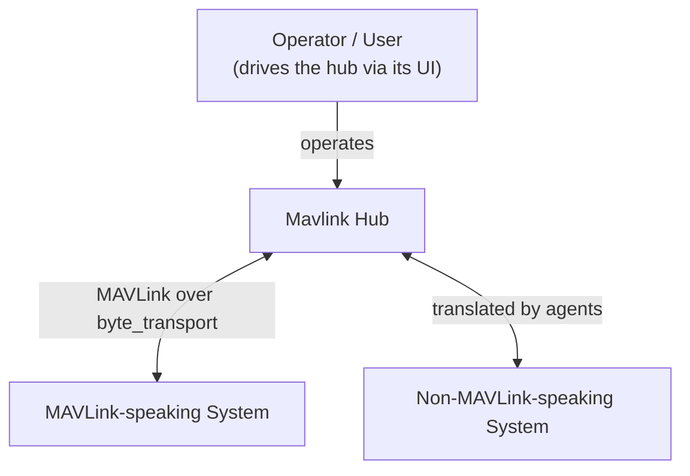
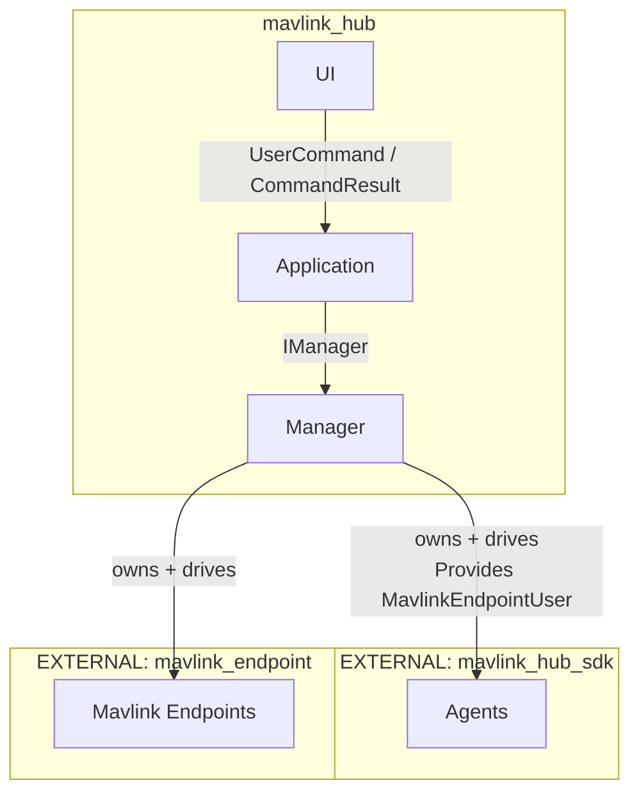
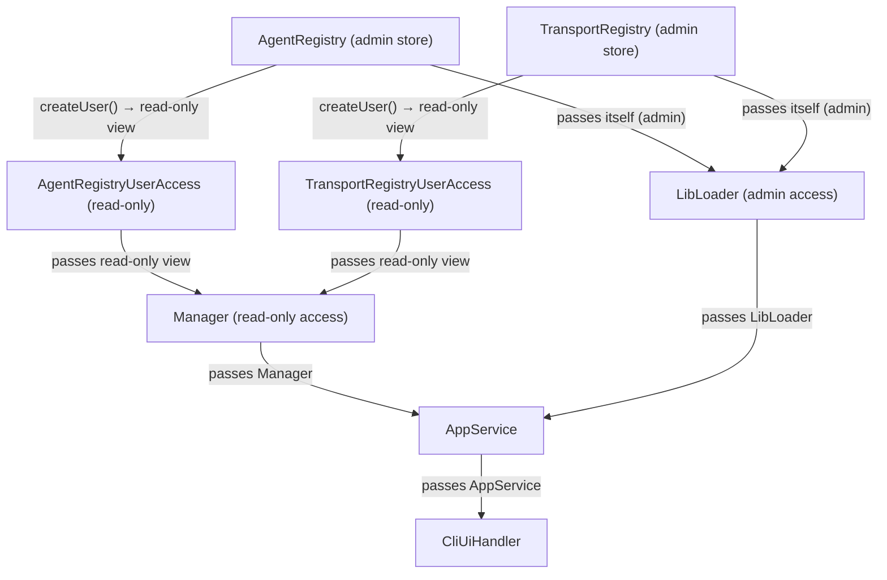

# mavlink_hub Architecture

This document describes the architecture of **mavlink_hub** (Pendarlab), a C++17 application
that acts as a hub for communicating with multiple MAVLink endpoints through a set of runtime
loaded *agents*.

All application code lives in the `pendarlab::app::mavlink_hub` namespace and is built as
SHARED libraries (`pendarlab-mavlink_hub_*`). The project is composed of three cooperating
external packages:

- `pendarlab::MavlinkHubSdk` (`mavlink_hub_sdk`) — defines the `Agent`, `AgentDefinition`,
  `AgentState`, `IMavlinkEndpointUser`, and `IManagerResourceRequester` interfaces the hub
  programs against.
- `pendarlab::MavlinkEndpoint` (`mavlink_endpoint`) — the MAVLink endpoint abstraction
  (`MavlinkEndpoint`, `MavlinkEndpointState`/`Packet`/`Token`).
- `pendarlab::ByteTransport` (`byte_transport`) — pluggable transports with their own
  `Registry`/`TransportDefinition` access-control model.

The document follows the **C4 model**, zooming in from a system-context view of how the hub
sits among the systems around it, to the components inside the `mavlink_hub` container, and
finally to the class-level internals of each component.

---

## Level 1 — System Context

At the outermost level, `mavlink_hub` is one system among many. An **operator** drives the hub
through its user interface. The hub in turn talks to two broad families of external systems:

- **MAVLink-speaking systems** — anything that already speaks the MAVLink wire protocol. The
  hub connects to these directly through `MavlinkEndpoint` instances, which sit on top of a
  pluggable `byte_transport` (serial, UDP, TCP, ...).
- **Non-MAVLink-speaking systems** — anything that does not natively speak MAVLink. The hub
  reaches these through runtime-loaded **agents** that translate between MAVLink and the
  foreign system's own protocol/interface.



**Examples of MAVLink-speaking systems** — anything that already speaks the MAVLink wire
protocol, connected directly through `MavlinkEndpoint` instances sitting on a pluggable
`byte_transport` (serial, UDP, TCP, ...):

- **Autopilots** — PX4, ArduPilot.
- **Ground control stations** — QGroundControl, Mission Planner, MAVProxy (and other
  MAVLink GCS / companion tools).

**Examples of non-MAVLink-speaking systems** — anything that does not natively speak MAVLink,
reached through runtime-loaded **agents** that translate between MAVLink and the foreign
system's own protocol/interface:

- **Simulators** — Gazebo / Ignition, Isaac Sim.
- **Onboard compute** — a mission computer.
- **Middleware / tooling** — a ROS / ROS 2 bridge.
- **Custom hardware** — proprietary sensors or devices.

**Key idea:** the hub itself is MAVLink-centric — every endpoint it owns is a MAVLink
endpoint. A system that does not speak MAVLink is only reachable because an *agent* bridges
the hub's MAVLink world and the foreign system's world. This keeps the hub's core simple while
making integration points (the agents and endpoints) pluggable.

---

## Level 2 — Components

`mavlink_hub` is a single deployable, and therefore a single **container**. Zooming in, it is
made up of several cooperating **components**. The in-hub components (developed in this
codebase) live inside the container: **UI**, **Application**, and **Manager**. Alongside them,
the hub integrates two **external-sourced packages** — **Agents** and **Mavlink Endpoints** —
which are not developed here but whose instances are created and owned by the Manager at
runtime:



*"EXTERNAL: <package>" boxes: packages not developed in mavlink_hub; their instances are managed
inside the hub runtime by the Manager.*

**Component responsibilities:**

- **UI** — the operator-facing front end. Model/view split: `CliUiController`
  (framework-agnostic model) and `CliUiHandler` (the ftxui view + thread).
- **Application** — the composition root and command front end. Holds `App`, `AppService`
  (the `UserCommand`/`IManager` mediator), `LibLoader` (dlopen plugin loading), and the
  startup/shutdown wiring.
- **Manager** — the domain core. Owns the live agent and endpoint instances and is their
  lifecycle factory, backed by the plugin-definition registries. Exposes everything through
  the `IManager` interface.
- **Agents** *(external: mavlink_hub_sdk)* — the plugin surface. Holds the SDK `Agent`/`AgentDefinition`
  abstractions and the concrete hub glue (`ManagerResourceRequester`, `MavlinkEndpointUser`)
  that lets an agent request and use endpoints.
- **Mavlink Endpoints** *(external: `mavlink_endpoint`)* — the endpoint surface. Wraps
  `MavlinkEndpoint` and its supporting types, which sit on top of `byte_transport`.

**Note on the code layout:** these components are *conceptual* C4 boundaries, and the code was
written before this architecture was documented, so the mapping is not one-to-one with the
folder layout. In particular, the code keeps the UI and the rest of the app together under
`src/app/` (with `ui_handler/` holding the UI part), and `src/manager/` is a standalone folder
that this document groups under the **Manager** component. The physical layout is authoritative
and is described in §4.

> **Note on "Agents" and "Mavlink Endpoints":** the `Agent`/`AgentDefinition` classes come from
> the SDK and `MavlinkEndpoint` from `mavlink_endpoint`, so neither is developed in mavlink_hub.
> They are drawn outside the container box to make that clear. Their *instances* are nevertheless
> created and owned by the **Manager** inside the hub runtime — an agent is loaded as a plugin
> `.so`, and the endpoints it reaches are managed by the Manager. They are the hub's *integration
> surfaces*: the two ways the hub reaches the outside world.

---

## Level 3 — Classes

This level zooms into the classes inside each component. `IManager`/`Manager`/`ManagerImpl`
and similar interface/concrete/implementation trios are each represented by a single entry.

### 3.1 Manager Component

`src/manager/` is the heart of the hub: it owns live **mavlink endpoints** and live
**agents** and exposes them through the **Manager** service. It also owns the
`agent_registry` (`src/agent_registry/`), the capability-separated store of agent-plugin
definitions that back the live agents.

#### 3.1.1 Manager

The service that owns and drives the hub's live endpoints and agents. It is the factory and
lifecycle owner of both, and the single entry point through which the rest of the application
manages them. To create agents and endpoints it needs the **agent registry** (to look up agent
definitions) and the **transport registry** (to resolve how an endpoint connects), both accessed
through read-only user views.

Its operations fall into five groups:

- **Plan management** — `validatePlan`, `executePlan`: pre-check and apply a bulk user plan.
- **Endpoint queries** — `getMavlinkEndpointList`, `getMavlinkEndpointState`,
  `getMavlinkEndpointStateAll`.
- **Agent queries** — `getAgentList`, `getAgentState`, `getAgentStateAll`.
- **Endpoint mutations** — `validateMavlinkEndpointConfig`, `addMavlinkEndpoint`,
  `connectMavlinkEndpoint`, `disconnectMavlinkEndpoint`, `removeMavlinkEndpoint`,
  `createMavlinkEndpointUser`, `removeMavlinkEndpointUser`, `getMavlinkEndpointUserList`.
- **Agent mutations** — `validateAgentConfig`, `addAgent`, `editAgent`, `startAgent`,
  `stopAgent`, `removeAgent`.

#### 3.1.2 AgentRegistry

The capability-separated store of agent-plugin definitions. It holds `AgentDefinition`
objects **non-owning** (the definitions are owned by the plugin libraries) and exposes two
access levels so components that only need to look things up never get the ability to mutate:
a read-only **user** view and a read-write **admin** view.

- `addAgentDefinition`, `removeAgentDefinition` — register/unregister a definition (admin).
- `createUser` — create a new read-only user view.
- `operator[]`, `showRegistered`, `isRegistered` — read-only lookups (inherited user view).

#### 3.1.3 AgentRegistryUser

The read-only user view over the AgentRegistry's backing store. It shares the live data but
cannot mutate it, and is what the **Manager** is given to look up definitions.

- `operator[]` — look up a definition by key.
- `showRegistered` — list the registered keys.
- `isRegistered` — test whether a key exists.

#### 3.1.4 ManagerResourceRequester

Injected into every **agent** the Manager creates. Through it an agent can ask the Manager for
whatever resource it needs (such as a mavlink endpoint) **without holding a concrete Manager
reference**.

- `requestMavlinkEndpoint` — ask the Manager for a mavlink endpoint, returning an
  `IMavlinkEndpointUser`.

#### 3.1.5 MavlinkEndpointUser

The handle the **Manager** gives to an agent when the agent asks for an endpoint through its
`ManagerResourceRequester`. It is a safe wrapper around a live endpoint, exposing only what an
agent needs to talk and listen.

- `createListener` — subscribe to incoming mavlink packets.
- `writeMessage` — send a mavlink message.
- `getState` — read the endpoint's connection state.
- `getNumOfListener` — count the current listeners.

### 3.2 Application Component

`src/app/` is the composition root and command front end. It wires the domain (Manager) to the
UI, loads plugins at startup, and dispatches user commands.

#### 3.2.1 App

The composition root. It constructs the registries, gives the read-only views to the
**Manager** and the admin views to the **LibLoader**, then assembles `AppService` and the UI
handler, and drives the runtime flow.

The diagram below shows how class instances are passed to other class instances — each arrow is
a **constructor injection**, handing one instance into another's constructor (the arrow's label
states what is passed):



**Runtime flow (`App::run`):**
1. `startup::parseArgs(argc, argv)` → `AppConfig` (or help/fatal-error exit).
2. `startup::applyConfig(config, lib_loader, app_service)` — loads plugins, optionally
   loads/applies a startup plan.
3. `cli_handler.start()` — spawns the ftxui UI thread.
4. `shutdown_controller.waitForShutdownSignal()` — blocks the main thread.
5. `cli_handler.stop()` — joins the UI thread, returns `0`.

A commented-out `HttpRequestHandler` in `App::run` indicates a planned second UI/command
handler.

#### 3.2.2 AppService

The mediator between the UI and the **Manager**. It receives a `UserCommand`, dispatches to the
appropriate Manager operation (or plugin loader), and returns a `CommandResult`. It tracks the
currently loaded `UserPlan`.

- `executeCommand` — dispatch a single user command (a large switch over the command type).
- `getCommandDescriptors` — report the commands the UI can present.

#### 3.2.3 Startup

Startup is split into an argument parser and an app configurator.

- **`ArgsParser`** — parses the command line (`-c/--config <path>`) with CLI11, loads and
  validates the JSON config file, and returns a `ParseResult { status, exit_code,
  optional<AppConfig> }`. Function: `parseArgs(argc, argv)`.
- **`AppConfigurator`** — applies a validated `AppConfig`: loads the configured agent/transport
  libraries via the `LibLoader`, optionally loads a startup plan, and (if configured) applies
  it. Function: `applyConfig(config, lib_loader, app_service)`.

#### 3.2.4 ShutdownController

A cross-thread coordination primitive (`std::mutex` + `condition_variable`) that keeps the main
thread alive while the UI runs on its own thread.

- `requestShutdown` — signal that shutdown is requested.
- `waitForShutdownSignal` — block until shutdown is requested.

#### 3.2.5 LibLoader

Loads agent and transport plugin shared libraries at runtime (`dlopen`) and registers their
definitions into the registries using **admin** access. `LibInfo` (`{ name, path, sym }`)
describes a plugin to load.

- `loadAgentLib`, `loadTransportLib` — load a plugin library and register its definition.

### 3.3 UI Component

The operator-facing front end with a clean **Model/View** separation: a framework-agnostic
controller (model) and an ftxui handler (view).

#### 3.3.1 CliUiController

The framework-agnostic model/state of the UI (unit-testable). It loads command descriptors from
`AppService`, tracks the selected/committed command and its payload, executes commands
**asynchronously on a worker thread**, and stores the resulting `CommandResult`.

- `commandDescriptors`, `commandEntries`, `selectedCommand`, `commitCommand`, `payload`,
  `setPayload`, `clearPayload` — model state for the command menu and payload.
- `executeCurrentCommand`, `commandResult`, `executing`, `joinExecution` — async execution on a
  worker thread.
- `setOnUpdate` — register a callback triggered when the state changes (used to redraw).
- `clearResult` — clear the stored result.

#### 3.3.2 CliUiHandler

The **ftxui** view. It builds the component tree (command menu, payload input, action buttons,
status bar, result pane), owns the UI thread, and drives the ftxui event loop.

- `start`, `stop` — manage the UI thread.
- `getResult` — currently a stub.

**User command flow:** menu selection → `commitCommand` → payload input → "Execute Command" →
`executeCurrentCommand()` builds a `UserCommand{type, payload}` → worker thread calls
`app_service.executeCommand(cmd)` → result stored + `onUpdate()` triggers a redraw.

### 3.4 Types Component

Data types shared by the application and UI layers (`app/types/`).

- **`UserCommand`** — `{ UserCommandType cmd_type; std::string payload; }`: one user request.
- **`UserCommandType`** — 23 command enumerators (plan lifecycle, status, endpoint management,
  agent management).
- **`CommandDescriptor`** — `{ UserCommandType type; std::string_view name; bool
  requires_payload; std::string_view payload_hint; }`: describes a command for the UI menu.
- **`commandDescriptors()`** — the canonical `constexpr std::array` table (one entry per
  enumerator, guarded by `static_assert`) the UI uses to build the menu.
- **`CommandResult`** — `{ bool success; std::vector<std::string> message; std::string
  data; }`: the outcome of a command.
- **`AppConfig`** — `{ agent_lib_list, transport_lib_list, path_to_extra_lib_list,
  path_to_startup_user_plan, apply_user_plan_on_startup }`: the startup configuration.

### 3.5 Common Component

Small shared utilities used across the hub (`common/`).

- **`JsonUtils`** (`common/json_utils/`) — the central JSON bridge (via `jsoncons`). Free
  functions convert between JSON and domain types: `fstreamToAppConfig`, `fstreamToUserPlan`,
  `stringToUserPlan`, `fstreamToLibList`, plus JSON-string encoders for execution results and
  agent/endpoint states. Honors `DISCARD` vs `BEST_EFFORT` policies when parsing lists.
- **`OperationResult`** (`common/types/`) — the universal result type
  `{ bool success = true; std::vector<std::string> messages; }` with `merge()` (ANDs success,
  concatenates messages). The building block of `ExecutionResultList`.

---

## 4. Directory Layout

```
mavlink_hub/
├── CMakeLists.txt
├── external/                      # vendored header-only deps (committed)
│   ├── cli11-2.7.2/               # command-line parsing (CLI11.hpp)
│   ├── jsoncons-1.9.0/            # JSON library (header-only)
│   └── ftxui-7.0.3/               # terminal UI (amalgamated ftxui.hpp/.cpp)
├── include/mavlink_hub/           # reserved for public/installed headers (currently empty)
├── resources/json_schemas/        # JSON schemas for user-command payloads
├── src/
│   ├── main.cpp                   # entry point (main executable target is commented out)
│   ├── agent_registry/            # AgentRegistry + Admin/User access
│   ├── manager/                   # Manager, plan execution, endpoint users
│   │   └── mavlink_endpoint_user/ # MavlinkEndpointUser (agent-facing endpoint handle)
│   ├── app/                       # application layer (composition root, UI, startup)
│   │   ├── app_service/
│   │   ├── lib_loader/
│   │   ├── shutdown_controller/
│   │   ├── startup/
│   │   ├── types/
│   │   └── ui_handler/
│   └── common/                    # JsonUtils, OperationResult
└── test/                          # GTest + mock libraries
```

Headers are colocated next to their `.cpp` files (e.g. `src/manager/Manager.h` next to
`Manager.cpp`). Both `src/` and `include/` are exposed as include directories on every target.

---

## 5. Build & Dependency Layout

Dependencies are found via `CMAKE_PREFIX_PATH` (external SDK packages installed under
`${HOME}/Creativity/devel-lib/pendarlab/<pkg>/<ver>`) plus `MAVLINK_HEADER_DIR` for the raw
mavlink headers. Vendored deps (`cli11`, `jsoncons`, `ftxui`) are committed and added as
per-target include dirs.

| CMake target | Output (SHARED) | Links |
|---|---|---|
| `MavlinkHubAgentRegistry` | `pendarlab-mavlink_hub_agent_registry` | SDK |
| `MavlinkHubManager` | `pendarlab-mavlink_hub_manager` | SDK, MavlinkEndpoint, AgentRegistry |
| `MavlinkHubShutdownController` | `pendarlab-mavlink_hub_shutdown_controller` | SDK |
| `MavlinkHubStartupArgsParser` | `pendarlab-mavlink_hub_startup_args_parser` | SDK, JsonUtils, cli11 |
| `MavlinkHubStartupAppConfigurator` | `pendarlab-mavlink_hub_startup_app_configurator` | SDK, JsonUtils |
| `MavlinkHubCliUiController` | `pendarlab-mavlink_hub_cli_ui_controller` | SDK, Threads |
| `MavlinkHubCliUiHandler` | `pendarlab-mavlink_hub_cli_ui_handler` | SDK, CliUiController, ftxui, Threads |
| `MavlinkHubLibLoader` | `pendarlab-mavlink_hub_lib_loader` | SDK |
| `MavlinkHubJsonUtils` | `pendarlab-mavlink_hub_json_utils` | SDK, MavlinkEndpoint, jsoncons |
| `MavlinkHubAppService` | `pendarlab-mavlink_hub_app_service` | ShutdownController, ArgsParser, CliUiHandler, LibLoader, JsonUtils, SDK |
| `MavlinkHubApp` | `pendarlab-mavlink_hub_app` | Manager, ShutdownController, ArgsParser, AppConfigurator, CliUiHandler, AppService, SDK |

The `mavlink_hub` main executable target is **commented out** in `CMakeLists.txt`; only
libraries + tests build.

---

## 6. Tests & Mocks

GTest executables are run directly from the build dir (no ctest). Two kinds of mocks:

**dlopen plugin mocks (SHARED):**
- `MavlinkHubMockAgent` (`test/mock_agent/`) — exports `getMockAgentDefinition()`.
- `MavlinkHubMockByteTransport` (`test/mock_byte_transport/`) — exports
  `getMockTransportDefinition()`.

**Header-only fakes (INTERFACE):**
- `MavlinkHubMockLibLoader` (`test/mock_lib_loader/MockLibLoader.h`) — fake of `ILibLoader`.
- `MavlinkHubMockAppService` (`test/mock_app_service/MockAppService.h`) — fake of `IAppService`.

| Test executable | Covers |
|---|---|
| `MavlinkHubManagerTest` | Manager: endpoint/agent lifecycle, plans (DISCARD/BEST_EFFORT), refcounting, resource requester |
| `MavlinkHubAgentRegistryTest` | **Stub** (no real tests yet) |
| `MavlinkHubLibLoaderTest` | dlopen plugin loading (success/bad symbol/bad path) |
| `MavlinkHubJsonUtilsTest` | JSON plan parsing + status encoders |
| `MavlinkHubStartupAppConfiguratorTest` | `applyConfig` wiring |
| `MavlinkHubStartupArgsParserTest` | CLI11 arg parsing |
| `MavlinkHubCliUiControllerTest` | Controller model (dispatch, async, callbacks) |
| `MavlinkHubCommandDescriptorTest` | Command descriptor table integrity |
| `MavlinkHubAppServiceTest` / `MavlinkHubAppTest` | Declared but **incomplete** (no `target_link_libraries`) |
| `MavlinkHubCliUiPreview` | Manual TUI preview (not a test) |

---

## 7. Current State & Known Gaps

The project is mid-development. Notable observations:

- `AppService::executeCommand` has many **stub** cases (most endpoint/agent commands,
  `GET_CURRENT_PLAN`, `GET_STATUS`).
- `include/mavlink_hub/` is **empty** — reserved for future public/installed headers; all
  headers currently live next to their `.cpp` files.
- `removeMavlinkEndpoint` does not proactively disconnect or check user refcounts before
  removal; `removeAgent` does not stop the agent before erasing (state is just recorded).
- `AgentRegistry` stores non-owning `reference_wrapper<const AgentDefinition>` — definitions
  are owned by plugin libraries, so unloading a plugin could dangle the references.
- The `mavlink_hub` main executable and `HttpRequestHandler` are planned but not yet active.
- `CliUiHandler::getResult()` is a stub.
